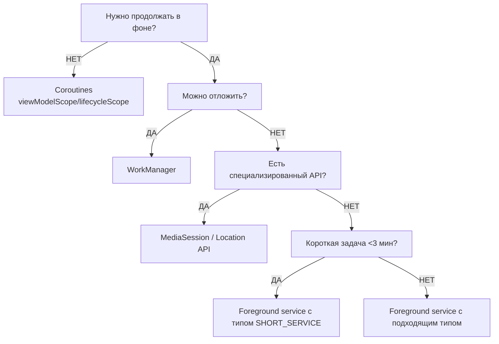
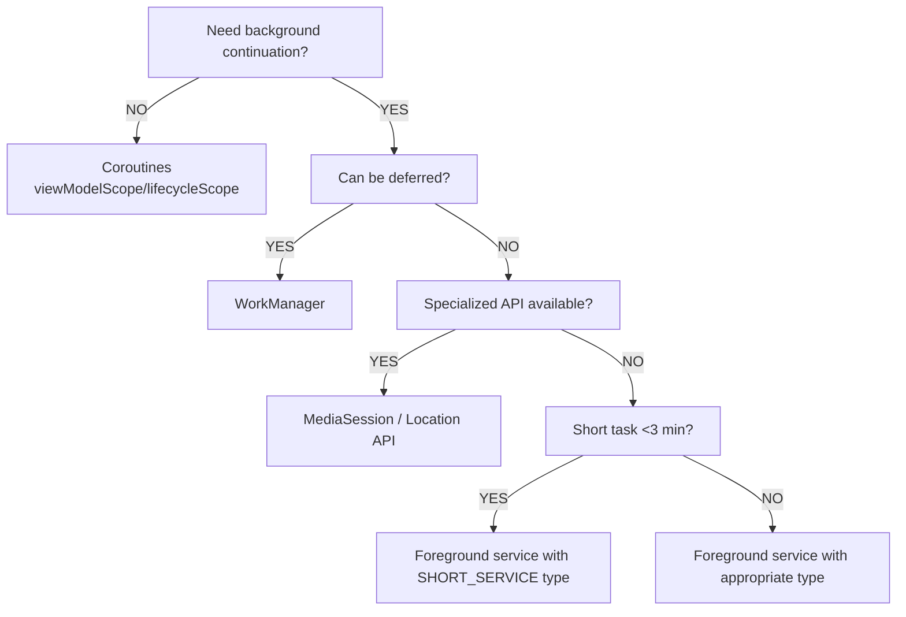

# Вопрос (RU)
> Как выбрать правильный способ выполнения фоновых задач в Android?

---

# Question (EN)
> How to choose the right approach for background tasks in Android?

---

## Ответ (RU)

**Подход**: Выбор механизма определяется тремя критериями — необходимость продолжения после закрытия UI, возможность отложенного выполнения, критичность немедленного старта.

**Дерево решений**:



**Категории**:

**1. Coroutines (lifecycle-aware)**
- Автоматическая отмена при уничтожении scope
- Применение: загрузка данных UI, вычисления для экрана

**2. WorkManager (отложенные задачи)**
- Надёжное (best-effort) выполнение с учётом ограничений системы (сеть, батарея, Doze Mode), с возможностью пережить перезагрузку устройства
- Применение: синхронизация, периодические загрузки, очистка кэша

**3. Foreground Services (немедленное / длительное выполнение)**
- Обязательное уведомление и строгие ограничения типов foreground-сервиса
- Применение: медиа, навигация, отслеживание активности, краткосрочные критичные задачи через `FOREGROUND_SERVICE_TYPE_SHORT_SERVICE` на поддерживаемых API-уровнях

**Код**:

```kotlin
// ✅ Coroutines: автоматическая отмена
viewModelScope.launch {
    val result = withContext(Dispatchers.IO) {
        repository.fetchData()
    }
    _uiState.value = result
}
// ⚠️ GlobalScope живет дольше, чем lifecycle-компоненты, что может привести к утечкам и крашам — избегайте для UI-заданий

// ✅ WorkManager: отложенная задача с ограничениями
val syncWork = OneTimeWorkRequestBuilder<SyncWorker>()
    .setConstraints(
        Constraints.Builder()
            .setRequiredNetworkType(NetworkType.UNMETERED)
            .setRequiresBatteryNotLow(true)
            .build()
    )
    .setBackoffCriteria(BackoffPolicy.EXPONENTIAL, 10, TimeUnit.SECONDS)
    .build()
WorkManager.getInstance(context).enqueue(syncWork)

// ✅ ShortService: критичная задача <3 мин (на поддерживаемых API-уровнях)
class FileTransferService : LifecycleService() {
    override fun onStartCommand(intent: Intent?, flags: Int, startId: Int): Int {
        ServiceCompat.startForeground(
            this, NOTIFICATION_ID,
            createNotification(),
            ServiceInfo.FOREGROUND_SERVICE_TYPE_SHORT_SERVICE
        )
        lifecycleScope.launch {
            transferFiles()
            stopSelf()
        }
        return START_NOT_STICKY
    }
}
// ⚠️ Обычный Service без foreground-статуса для долгих задач имеет повышенный риск быть убитым системой (особенно в фоне) и не должен использоваться для продолжительных операций
```

**Ключевые моменты**:
- **Coroutines**: используйте структурированные scope (`viewModelScope`, `lifecycleScope`) для автоотмены
- **WorkManager**: обеспечивает устойчивое выполнение даже после перезагрузки устройства и учитывает Doze Mode; точное время запуска контролируется системой
- **ShortService**: использует тип `FOREGROUND_SERVICE_TYPE_SHORT_SERVICE`, доступный только на поддерживаемых версиях Android и предназначенный для задач с жёстким лимитом выполнения (~3 минут)
- **Избегайте**: обычных Service без foreground-режима для продолжительных задач; они нестабильны и подвержены убийству системой

---

## Answer (EN)

**Approach**: Selection is driven by three criteria — background continuation requirement, deferability, and criticality of immediate start.

**Decision tree**:



**Categories**:

**1. Coroutines (lifecycle-aware)**
- Automatic cancellation on scope destruction
- Use cases: UI data loading, screen computations

**2. WorkManager (deferred tasks)**
- Best-effort reliable execution respecting system constraints (network, battery, Doze Mode), with ability to survive device reboot
- Use cases: synchronization, periodic downloads, cache cleanup

**3. Foreground Services (immediate / long-running work)**
- Mandatory notification and strict foreground service type requirements
- Use cases: media playback, navigation, activity tracking, and short critical tasks via `FOREGROUND_SERVICE_TYPE_SHORT_SERVICE` on supported API levels

**Code**:

```kotlin
// ✅ Coroutines: automatic cancellation
viewModelScope.launch {
    val result = withContext(Dispatchers.IO) {
        repository.fetchData()
    }
    _uiState.value = result
}
// ⚠️ GlobalScope outlives lifecycle components and can cause leaks/crashes — avoid it for UI-related work

// ✅ WorkManager: deferred task with constraints
val syncWork = OneTimeWorkRequestBuilder<SyncWorker>()
    .setConstraints(
        Constraints.Builder()
            .setRequiredNetworkType(NetworkType.UNMETERED)
            .setRequiresBatteryNotLow(true)
            .build()
    )
    .setBackoffCriteria(BackoffPolicy.EXPONENTIAL, 10, TimeUnit.SECONDS)
    .build()
WorkManager.getInstance(context).enqueue(syncWork)

// ✅ ShortService: critical task <3 min (on supported API levels)
class FileTransferService : LifecycleService() {
    override fun onStartCommand(intent: Intent?, flags: Int, startId: Int): Int {
        ServiceCompat.startForeground(
            this, NOTIFICATION_ID,
            createNotification(),
            ServiceInfo.FOREGROUND_SERVICE_TYPE_SHORT_SERVICE
        )
        lifecycleScope.launch {
            transferFiles()
            stopSelf()
        }
        return START_NOT_STICKY
    }
}
// ⚠️ A regular Service without foreground status for long-running work is at high risk of being killed by the system (especially in background) and must not be used for long operations
```

**Key points**:
- **Coroutines**: use structured scopes (`viewModelScope`, `lifecycleScope`) for auto-cancellation
- **WorkManager**: provides robust execution even after device reboot and respects Doze Mode; exact timing is controlled by the system
- **ShortService**: uses `FOREGROUND_SERVICE_TYPE_SHORT_SERVICE`, only available on supported Android versions, and is intended for work that must complete within the enforced time limit (~3 minutes)
- **Avoid**: using regular Services without foreground mode for long-running tasks; they are unstable and likely to be killed by the system

---

## Follow-ups

- How does Doze Mode affect WorkManager execution timing and constraints?
- What happens to ShortService if execution exceeds 3 minutes timeout?
- When to use ExactAlarmPermission vs WorkManager for time-sensitive operations?
- How to implement graceful degradation when foreground service permission is denied?
- What are the battery implications of using START_STICKY vs START_NOT_STICKY?

## References

- [[c-coroutines]]
- [[c-service]]
- [[c-workmanager]]
- https://developer.android.com/develop/background-work/background-tasks
- [Foreground Services](https://developer.android.com/develop/background-work/services/foreground-services)

## Related Questions

### Prerequisites (Easier)
- [[q-android-service-types--android--easy]]
- [[q-android-services-purpose--android--easy]]
- [[q-what-are-services-for--android--easy]]

### Related (Same Level)
- [[q-what-is-workmanager--android--medium]]
- [[q-foreground-service-types--android--medium]]
- [[q-async-operations-android--android--medium]]
- [[q-workmanager-execution-guarantee--android--medium]]

### Advanced (Harder)
- [[q-service-lifecycle-binding--android--hard]]
- [[q-workmanager-chaining--android--hard]]
